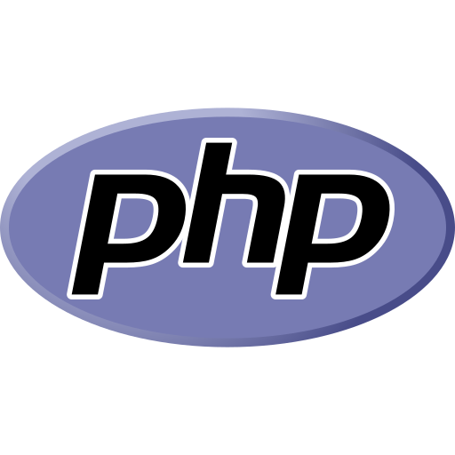

#  PROJETO TCC 

# __LINGUAGENS UTILIZADAS__

- [x] PHP COM O FRAMEWORK LARAVEL
- [x]  JAVA SCRIPT 

# __SISTEMA__

* ESTE PROJETO TEM COMO OBJETIVO APRESENTAR UM DESEMVOLVIMENTO WEB RELACIONADO A EVENTOS, O MESMO LISTA EVENTOS QUE ESTÃO SENDO DIVULGADOS PELOS PRÓPRIOS CRIADORES. OS PRINCIPAIS UTILIZADORES DESSE SISTEMA SÃO OS USUÁRIOS QUE BUSCAM CONHECIMENTOS EM FORMA DE PALESTRAS PRESENCIAIS, PALESTRANTES E ORGANIZADORES DE EVENTOS. NO SITE ESTÁ PRESENTE ALGUNS EVENTOS RELACIONADOS A VÁRIAS CATEGORIAS, COMO: CONHCIMENTO NA AREA DE T.I, LINGUAGENS DE PROGOMAÇÃO E ENTRE OUTROS. PRIMEIRAMENTE O USUÁRIO PRECISA SE CADASTRAR NO SITE PARA PODER VISULIZAR TODOS OS EVENTOS DISPONÍVEIS, AO SE CADASTRAR O MESMO VISUALIZARÁ UM CAMPO DE PESQUISA NO CENTRO DO LAYOUT, ESSE CAMPO SERÁ UTILIZADO PARA PESQUISAR OS ASSUNTOS REFERENTE A CADA PREFERENCIA DESEJADA. APÓS REALIZAR O CADASTRO NO SITE E CONSEGUIR ENTRAR COM O LOGIN CADASTRADO, O USUÁRIO CONSEGUIRÁ APORVEITAR TODOS AS FERRAMENTAS E ESUFRUIR DE CADA EVENTO. 

